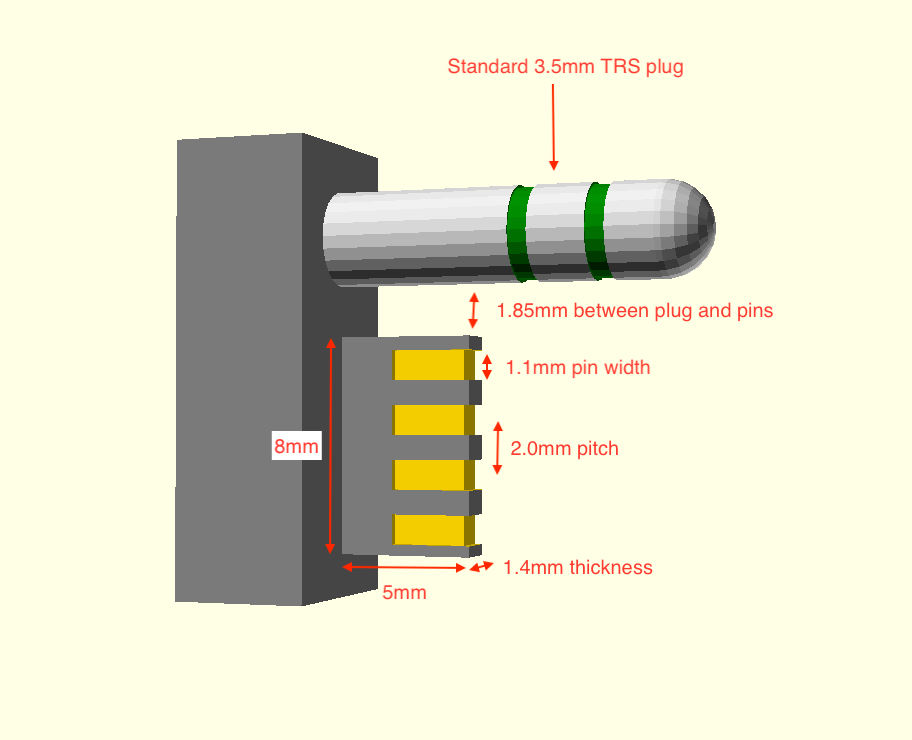
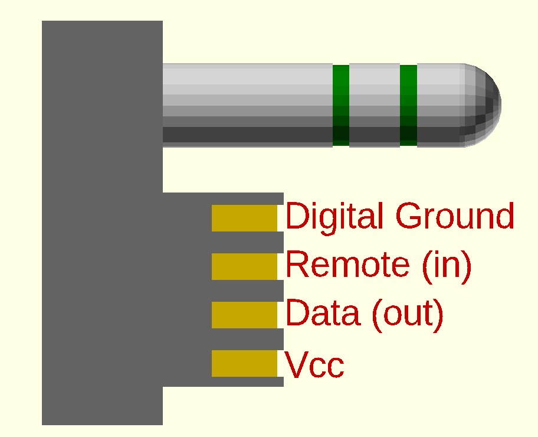

Sony TRS + 4-Pin Connector
========================

This is information about the physical dimensions of the connector and the basic pinout of the connector.

## Dimensions

The connector is a modification of the common 3.5mm headphone jack (aka "1/8th inch jack" or "stereo minijack").

It adds an addition 4-pin edge connector to the side of the 3.5mm jack. This connector is used for controlling the player and displaying information about what is currently being played.

The spacing between the TRS plug and the edge connector is about 1.85mm.

The exact dimensions of the edge connector vary between different remote models, but the rough dimensions are:
* 8mm wide
* 5mm long
* 1.4mm thick

The 4 pins on the connector are each:
* 1.1mm wide
* 3mm long
* use 2.0mm pitch (on-centre spacing)

The pins are inset from the outside of the connector by about 0.25mm.

## Pinout

The *most common* pinout for the edge connector is, starting from the side closest to the TRS plug:
1) Digital Ground
2) Remote (button) input
3) Data (LCD display) output
4) Vcc

One of the outliers I have found that do not follow that standard is the MW-FX855 Cassette Walkman, and there may be others so be sure to verify pinouts and voltages before doing anything you might regret.

### Digital Ground

Ground pin for use with the Data pin (pin 3). Usually isolated from audio ground.

### Remote (button) input

Control the functions of the player using this pin. Connect this pin to `Vcc` through a resistor network, the resistance defines the action.

### Data (LCD display) output

A digital signal to show information on the LCD display on the remote (if it has one). This is most often an active-low signal but where are players that use an active-high signal as well.

### Vcc

Usually regulated power from 2.1v to 2.9v DC, but some players use a direct connection to battery/power instead.

## How to make a DIY connector

(TODO: include pictures)

## Model

An [OpenScad model](connector.scad) is included in this repo.
