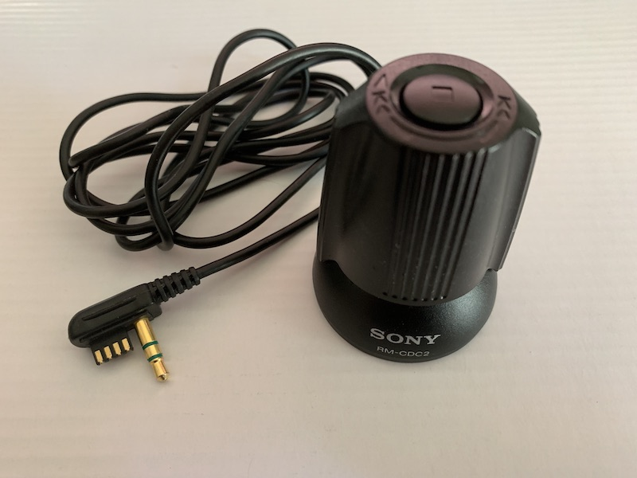
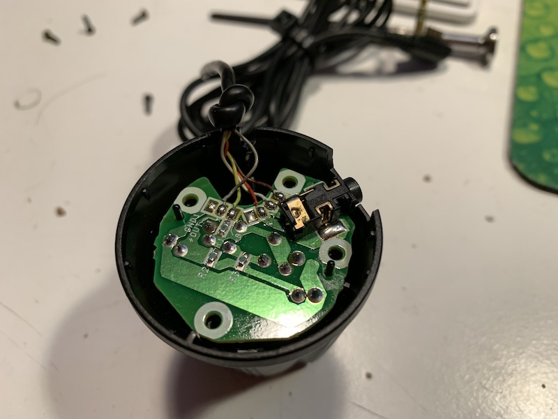

Sony RM-CDC2 Remote
=========================================

This remote has no display, and does not require external power from pin 4 to
operate.

## Buttons/Actions

1 stop button, two turn actions: ffwd/play and rwd.

## Operation

Stop button works as expected, but next and prev actions work irregularly
depending on device. Example, on D-EJ815 CD player the "prev" action turns
on shuffle.

## Wiring

Pins 1 and 3 are disconnected internally. The wire has enough strands but they
are simply not connected.

## Button Resistances

Multimeter wiring:

Remote pin 2 (RMT) disconnected from player, connected to negative of multimeter.
Remote pin 4 (VCC) disconnected from player, connected to positive of multimeter.

Remote pins 1 and 3 are disconnected from  player.

* Rest
  - 0
* Prev
  - 0.994k
* Next/Play
  - 3.57k
* Stop
  - 7.03k
