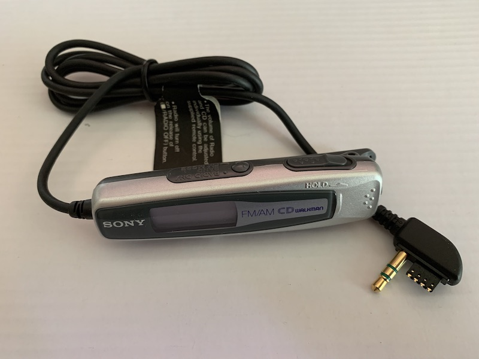

Sony RM-CDF7L Remote
====================

Originally for an AM/FM-enabled CD-Walkman. It is surprisingly compatible with
other players.

It must be connected to a player that support the radio function in order for radio to work.

It looks physically identical to the [RM-MZ1T](Sony+RM-MZ1T.md) except
for the "CD Walkman" branding. There may be protocol-level differences
between the two models.

## Compatibility

Testing working (display+buttons) with

* MZ-NRF800 MD Walkman recorder
* D-EJ815 CD Walkman player
* MZ-E505 MD Walkman player

This means the remote is data-compatible with at least two different versions
of the display protocol (the versions used in the MZ-NRF800 and MZ-E505 are
different).

## LCD

Standard CD player type display with track numbers (00-99), time index (doubles
as radio frequency display, volume display, and group/step number display), and
mode indicators (repeat, AVLS, etc).

Track number May be able to use the time index field to display track title
text, but does not work in MZ-NRF800 or MZ-E505 test players.

## Buttons

All buttons function as expected with the exception of "Radio On" button (which
is expected).

Because the internal resistor ladder is switched using MOSFETs, power must be
applied to the VCC pin for the buttons to work. Consquently, you can't use the
buttons to wake up the player from "off" state with any remote buttons.

## Operation

### Connected to MZ-NHF800

Although the remote data line comes alive when you press "Stop" on the player
from an "off" state, that data stream does not seem to effect the display on the
remote in any way.

### Connected to D-EJ815

Working. More detail TBA.

### Connected to MZ-E505

Working. More detail TBA.

## Wiring

Resistance between pins 1 and 3 (with power disconnected) starts at about 1.6meg
and then settles down to 1.83meg.

## Button Resistances

Multimeter wiring:

Remote pin 2 (RMT) disconnected from MD player, connected to negative of multimeter.
Remote pin 4 (VCC) remains connected to MD player, also connected to positive of multimeter.

Remote pins 1 and 3 remain connected to MD player.

* Rest (nothing pressed)
  - 0
* Vol +
  - 9.8k
* Vol -
  - 8.38k
* Play
  - 0.363k
* Prev
  - 1.037k
* Next
  - 3.67k
* Stop
  - 7.09k
* Hold switch on
  - 0.5meg to 0.65meg (fluctuates)

TODO: check if `Radio On` sends a resistance signal, too.

## Voltage

Tested with Vcc of 2.1v and logic level of 2.1-to-2.3v.

## TODO

LCD signal protocol
