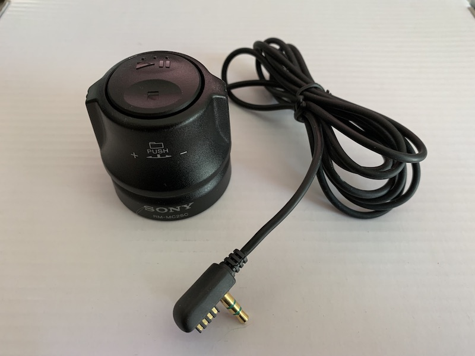

Sony RM-MC25C Remote
=========================================

This remote has no display, and does not require external power from pin 4 to
operate.

## Buttons

Connected to MZ-NHF800, all buttons function as expected except next/prev folder ("push + turn") which
seems to move 10 tracks ahead or behind. It would probably change groups if playing in group mode.

## Operation

The play button can wake the player from a sleep/off state.

## Wiring

Resistance between pins 1 and 3 (with power disconnected) is zero ohms.

## Button Resistances

Multimeter wiring:

Remote pin 2 (RMT) disconnected from MD player, connected to negative of multimeter.
Remote pin 4 (VCC) disconnected from MD player, connected to positive of multimeter.

Remote pins 1 and 3 are disconnected from MD player.

* Rest
  - 0
* Play
  - 0.329k
* Prev
  - 1.004k
* Next
  - 3.63k
* Stop
  - 7.06k
* Next Folder (push+turn)
  - 11.84K
* Prev Folder (push+turn)
  - 5.14k
