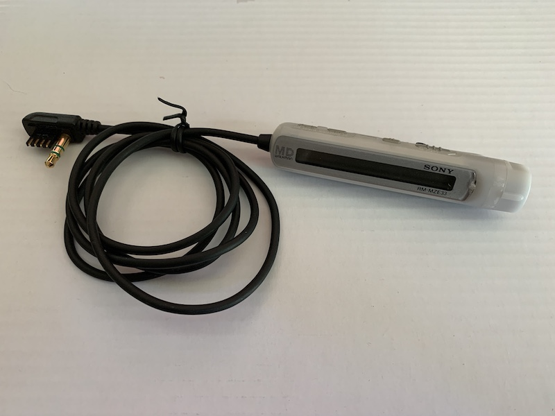

Sony RM-MZE33 Remote
====================

Remote originally included with MZ-E33 MiniDisc player.

## Compatibility

Certaily works with MZ-E33. Tested working with MZ-E501.

Buttons tested and working with:
* MZ-NHF800
* D-EJ815

Tested and found display *not working* with:
* MZ-NHF800
* D-EJ815
* WM-FX855

## LCD

Full dot-matrix LCD text area.

## Buttons

TBA

## Operation

TBA

## Wiring

Resistance between pins 1 and 3 (with power disconnected) is 0.372meg.

## Button Resistances

TBA

## Voltage

TBA

## TODO

LCD signal protocol
