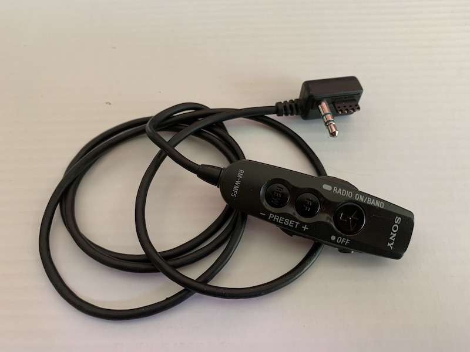

Sony RM-WMF5 Remote
===================

Originally shipped with Walkman WM-FX494 and MW-FX496ST.

## Buttons

No display, transport and radio control buttons only. Volume wheel only.

3 buttons:
* Play / Switch Direction / Stop / Radio-On-Off
* FF / Next Preset
* RW / Previous preset

Hold switch is interesting in that, instead of disconnecting the remote control
pins like most other remotes do, it physically blocks the buttons from being
pushed.

## Pinout differences

Unlike the majority of remotes that connect pin 4 to pin 2 through a resistor to signal a button, RM-WMF5 connects pin 2 to pin 1 through a resistor.

This means the remote port on compatible Walkman players uses pin 2 with *pull-up* rather than *pull-down* like most other players

## Wiring

Remote gives 0.227meg resistance between pins 1 and 3 while connected to player

## Button Resistances

Meter connected between pin 1 and pin 2 (instead of more common 2 and 4).

* Rest
  - 0 ohms
* Play / Reverse / Stop
  - 0.814k ohms
* FF / Next Preset
  - 1.803k ohms
* REW / Previous Preset
  - 3.01k ohms
* Hold Switch
  - 0 ohms

