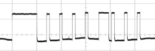
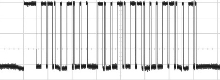

Display Protocol for Cassette Walkman 4-pin Remote
==================================================

**Note**: this is based only on research with one player, WM-FX855. The protocol will likely vary on some other cassette Walkman models (since their remote controls are not universally compatible).

Please see https://github.com/xunker/SonyMDRemote for more information.

## Introduction

The display protocol used for the cassette Walkman (hereafter "Walkman", even though that branding was also used on some CD and MD players) is significantly different from the protocol used in MD and CD players.

## Electrical

Data is sent down remote connector pin 3, and pin 1 is used as the ground. The signal is active-high and the high voltage is slightly below pin 4 (battery). This means that the signal high level will drop as the battery voltage drops, from 1.5v (full) to whatever level the Walkman stops working at.

Signals of this level may be problematic to detect on a 3.3v microcontroller. For example, the AT91SAM3X8E (Ardino Due) requires >= 2.3v for high (0.7 * VDDIO) and 0.99v (0.3 × VDDIO) for low. This means, by itself, the Due will have problems "seeing" the signals with `digitalRead`.

## Logical

Start of message is signaled by high for 5ms, followed by low for 2ms.

`Zero` is indicated by 550-600us high followed by 2ms of low.

`One` is indicated by 2ms high followed by 550-600us of low.

Messages are only sent when a button is pushed, or if the player does an automatic action (like triggering of auto-reverse at the end of the side of a tape).

Data is send most-significant-bit-first (big-endian).

### Message structure and length

Messages are either 8- or 24-bits long. There are no start or stop bits sent.

If the message is 24-bits long, there is a 2ms low between the first 8 bits and and remaining 16 bits. There is no pause between the second two bytes.

8-bit message:

24-bit message:

### First Byte

Starting from MSB (left-most), the first bit indicate the type of message this is about:
* `1`: radio, indicates we are currently listening to the radio
* `0`: tape/state related, either we are in tape mode or it is information about the tape/system state

#### Radio Message

Index (MSB First) | Meaning
------------------|------------------------------------------------
0                 | message type (`1` = radio)
1                 | `1` = normal listening, `0` = ASP learning mode
2                 | Tape direction, `0` = fwd, `1` = rev
3                 | ?
4..7              | Current preset number as BCD

Messages beginning with `11` (Radio message, normal listening mode) will always include an additional 2 bytes of extra attribute data representing the current radio tuning.

When the ASP process begins (long-pressing the ASP button) the message `10010000` is sent, and when the process is complete the message `10101010` is sent and that a standard station tuning message. However, when only a specific band is scanned (long-pressing the enter button) then `10101010` is sent at the start and standard station tuning message is sent at the end.

#### Tape or State Message

##### Upper 3 bits

Index (MSB First) | Meaning
------------------|----------------------------------
0                 | message type (`0` = tape)
1..2              | current action (see list below)

Value for `current action` can be:
* `00`: playing or stopped
* `10`: rewinding
* `01`: fast-forwarding
* `11`: state indicator

##### Lower 5 bits for playing or stopped:

Index (MSB First) | Meaning
------------------|--------------------------------------
3                 | Tape direction, `0` = fwd, `1` = rev
4..5              | `10` = playing, `01` = stopped
6..7              | ? (MT_WZL indicator)

##### Lower 5 bits for fast-forwarding or rewinding:

Index (MSB First) | Meaning
------------------|--------------------------------------
3                 | Tape direction, `0` = fwd, `1` = rev
4..7              | BCD of current "AMS" counter

##### Lower 5 bits for "state indicator"

Index (MSB First) | Meaning
------------------|------------------------------------------------
3                 | Current mode (`0` = radio, `1` = tape) (unsure)
4                 | ? (MT_WZL indicator)
5..7              | BCD of Bass Boost level (0,4, or 6)

The purpose of bit 3 s based on these observations ("xxxx" is the Bass Boost level and can be ignored for these examples):
* Turning on radio from an off state, `0110xxxx` is sent
* Playing a tape from an off state, `0111xxxx` is sent
* *Sometimes*, switching from tape to radio will cause `0111xxxx` and `0110xxxx` to be sent in a pair
* Pressing stop from radio mode, `0111xxxx` is sent
* Pressing stop from tape mode, *no* "status indicator" message is sent
* From stopped state, pressing fast-forward or rewind: `0110xxxx` is sent

### Second and Third Bytes

In tape mode, only the first byte is sent and these additional bytes are not sent. In radio mode, these bytes indicate the current frequency and frequency band.

Index (MSB) | FM Mode       | AM Mode       | TV Mode             |
------------|---------------|---------------|---------------------|
0..3        | Tens          | Hundreds      | Ones                |
4..7        | Ones          | Tens          | Unused              |
8..11       | Tenths        | Ones          | `1100` = TV mode    |
12..13      | Hundreds      | Thousands     | Tens                |
14..15      | Band          | Band          | Band                |

`Band` fields:
* `10`: FM
* `00`: Depends on the value of field `8..11`:
  - AM mode if 8..11 field does not equal `1100`
  - TV mode if 8..11 field equals `1100`

Examples:
* `11000001 1001011101010010` (97.5mHz, preset 1)
* `11000010 0000000001110110` (100.7mHz FM, preset 2)
* `11000011 0000000100010110` (101.1mHz FM, preset 3)
* `11000100 0000000101010110` (101.5mHz FM, preset 4)
* `11000101 0100001100000100` (1430kHz AM, preset 5)
* `11000000 0101001100010000` (531kHz AM, no preset)
* `11000000 1000000000000000` (800kHz AM, no preset)
* `11000000 0100010000000100` (1440kHz AM, no preset)
* `11000000 0111000100000100` (1710khz AM, no preset)
* `11000000 0001000011000000` (TV 1ch, no preset)
* `11000000 0010000011000000` (TV 2ch, no preset)
* `11000000 0011000011000000` (TV 3ch, no preset)
* `11000000 0000000011000100` (TV 10ch, no preset)
* `11000000 0001000011000100` (TV 11ch, no preset)
* `11000000 0010000011000100` (TV 12ch, no preset)
