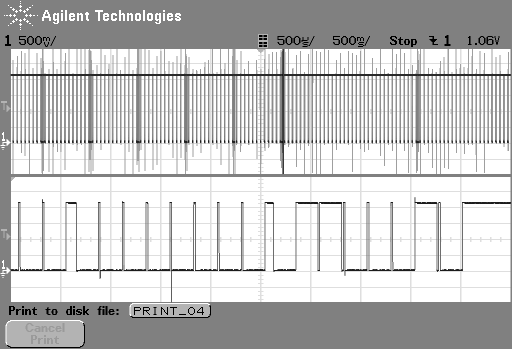

# Sony MD Remote Display Protocol

This is the technical detail of what I found while reverse-engineering the
protocol used to transmit data from my MZ-NHF800 MiniDisc recorder to an
RM-CDF7L remote.

I believe this protocol is *different* from that used in earlier MiniDisc
player recorders. Pease see the "Multiple Versions?" section for more detail

## Multiple Versions?

I believe there are at least two different versions of the signaling protocol
used to drive the display on the remote. The only detailed technical data I can
find a is [description of the signaling used in the MZ-R3](htoerrin_mz_r3/Untitled.html)
by Havard Toerrin, but the data therein does not match what I found when I
tested my own MZ-NHF800.

As well, the LCD on many remotes from 1990's MD players do not seem to work
on players from the 2000's. Based on these two point, I believe the protocol
changed sometime after the MZ-R55.

### Differences

In Havard Toerrin's original description the data line is active-high at 2.9v
with significantly shorter reset pulses and significantly longer data pulses.

## Signal Structure

The primary signal is **active-low** carried on the remote data line (pin 2)
which is pulled-up to about 2.1v from VCC (pin 4) via 1 meg-ohm resistor (in the
case of MZ-NHF800).

Low level is about 0v as referenced to the player data ground (pin 1), which is
electrically isolated from analog ground.

## Timing

Messages are sent contiually from the player at 25Hz start-to-start. Which is
to say there is 40ms between the start of one message and the start of the next.

### Minimum and Maximum Message Length

Message length varies, with the shortest around 6ms and the longest a
little under 30ms.

## Message Structure

### Sync/Reset

Messages begin by a sync/reset signal  of **low for 1ms** followed by
**high for 1ms**.

#### Sync without data?

I have seen message that appear to be just the 1ms low signal with nothing else.
These could be clock syncronization or buffer-clear signals, but I'm not sure.

I can capture them on a microcontroller but haven't beem able to catch them on
an oscilloscope to examine them so I am not certain they are real or signal
errors in my code.

### Bit pattern

When binary data is sent, the device sends it little-endian (LSB, Least
Significant Bit first).

## Message Structure

### Basic ("Short") Messages

These are the most common message and look to account for over 90% of traffic.
These messages do not cause any change on the RM-CDF7L remote so they may be
be messages that are simply not carying a payload because they look similar to
the first part of "long" messages.

The message consists of
* 2ms low-high sync
* 2.1ms bits
  - I am not sure if this is 8 or 9 bits because there are 9 low periods but only 8 disctinct high periods
* 250us high period
* 1.9ms of 8 bits

The message can end at this point, or continue on in to a "long" message.

The timing of the bit pulses varies between 100us to 195us for low pulses and
20us to 105us for high pulses. This is different than the timing found in the
laster part of the message if it is a "long" message.

#### Bit Structure

The structure for bits in this first part of the message may be different than
the format in the rest of the message ("Long" message portion), further
research is needed.

### Long Messages

These longer messages are the previous basic/short message with additional data
added on the end. They usually contain 212 level transitions including the
first sync/reset and the last rise to the line-at-rest level.

#### Bit Structure

The timing of the bit pulses looks to be different than the time in the first
part of the message (the "short" message). Here, the high/low periods are
generally consistant with short pulses being 5us-10us long and long pulses
being 190us-210us.

**short high (5us-10us) followed by a long low (190us-210us)** indicates **0**.

**long high (190us-210us) followed by a short low (5us-10us)** indicates **1**.

There are also regular intervals where the high pulse will be between 70us and
210us. Since these appear at interals of 8 low pulses I believe they are byte
delimiters of some kind. Believe this means that when **a high pulse >70us is
followed by a low pulse >70us, it indicates the start of a new byte**.

I base those findings on decyhering that track numbers are sent to the
remote as a pair of 4-bit BCD digits, and that the last track number byte
appears at the very end of a message where is it preceeded by a equal-length
high-low pulse.

#### Examples

## Author and Location

Matthew Nielsen, June 2020

https://github.com/xunker/SonyMDRemote/protocol/

## Attributions

This could not have happened without work originally done by [Havard Toerrin](https://web.archive.org/web/20090217092709/http://home.no.net/~htoerrin/md_if/md_spek.htm).

## License

Unless otherwise specified, content of this repository is licensed under the
[Creative Commons Attribution 4.0 International License](https://creativecommons.org/licenses/by/4.0/).
